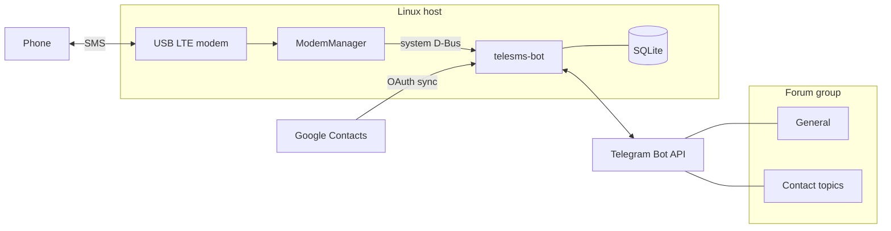
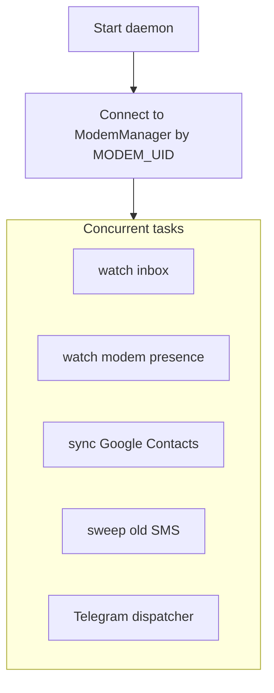
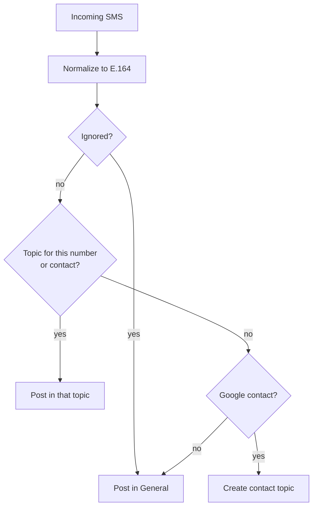
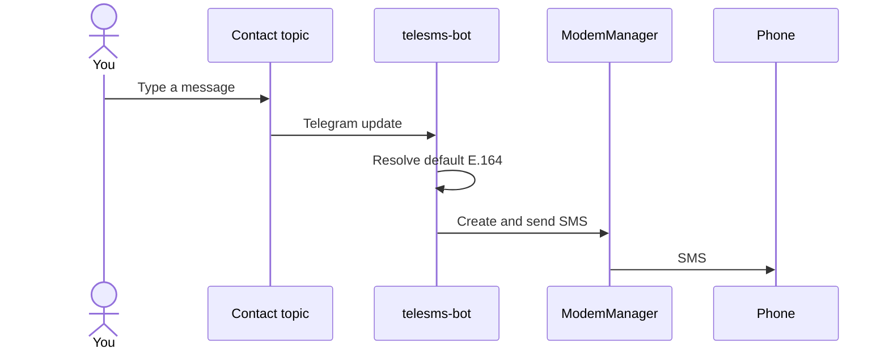
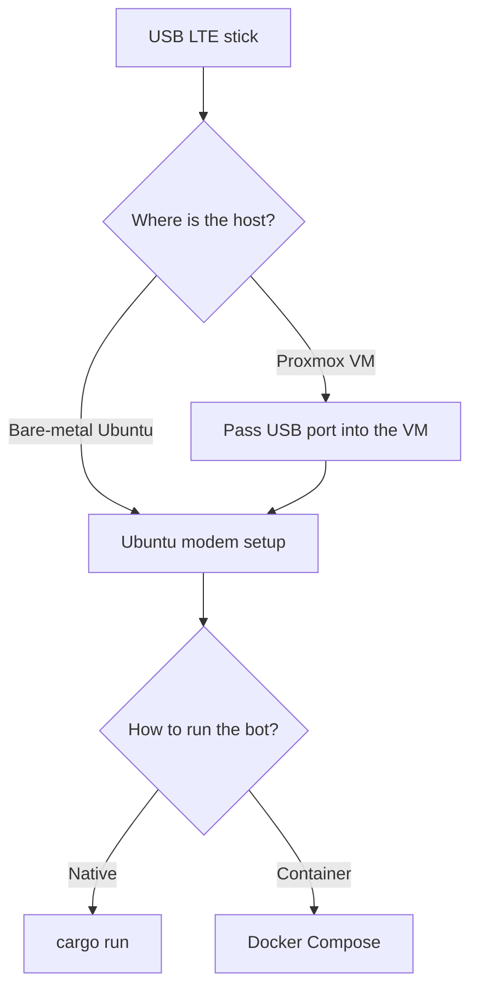

# telesms-bot

Personal two-way **SMS ↔ Telegram** gateway. A USB LTE modem on a Linux
host, owned by ModemManager, is bridged to a private Telegram **forum
group**: one General topic plus an on-demand topic per contact.

Incoming SMS land in the matching topic. Anything you type in a contact
topic is sent as SMS. Names and numbers come from Google Contacts.

| Aspect | Detail |
|---|---|
| Hardware | USB LTE stick (tested: D-Link DWM-222 / QMI) |
| Host | Ubuntu with ModemManager; optional Proxmox USB passthrough |
| Runtime | Native `cargo run`, or Docker Compose next to host ModemManager |
| Audience | A single Telegram user in a single forum group |

---

## Architecture

The bot never opens `/dev/cdc-wdm0` or `ttyUSB*`. It talks to
**host** ModemManager over the system D-Bus. Contacts sync over Google
People API. Telegram is the only user interface.



The daemon runs several loops in parallel: inbox subscribe, modem
presence, periodic contact sync, optional SMS sweep, and the Telegram
dispatcher.



---

## How messages route

**Inbound.** An SMS is normalized to E.164, then matched against Google
contacts and existing topics. Unknown or ignored numbers stay in
General.



**Outbound.** Text in a contact topic is an SMS to that topic’s default
number. Text in General is **not** sent unless you use `/sms`.



---

## Deploy

Put the stick on the machine that will run ModemManager. If that machine
is a VM, pass the USB **port** through first.



| Guide | When to use it |
|---|---|
| [Ubuntu modem setup](docs/ubuntu-modem-setup.md) | Packages, stable `MODEM_UID`, enable, register, SMS sanity check |
| [Proxmox USB passthrough](docs/proxmox-usb-passthrough.md) | Stick is on a Proxmox host; guest is Ubuntu |
| [Docker Compose](docs/deploy-docker.md) | Run the bot next to host ModemManager |

`scripts/setup-ubuntu-modem.sh` installs packages and can pin a stable
UID. Do **not** run ModemManager inside Docker. On Ubuntu, Compose sets
`apparmor:unconfined` so the mounted system D-Bus socket actually works.

---

## Quick start (native)

1. **BotFather** — create a bot, disable privacy mode, enable inline
   mode, add it to a **forum** group as admin with permission to manage
   topics.
2. Copy `.env.example` → `.env`. Fill the bot token, your Telegram user
   id, and the group id (`-100…`).
3. **Google Cloud** — OAuth desktop client with Contacts readonly. Put
   the client id and secret in `.env`.
4. `cargo run -- auth` writes `./secrets/google-token.json` (needs a
   browser).
5. Stick **registered**: [Ubuntu modem setup](docs/ubuntu-modem-setup.md).
6. `RUST_LOG=info cargo run`
7. In General: `/sms 09… hello`. Confirm the phone and a Telegram ✓.

On the machine that owns the stick, you can skip native run and use
[Docker Compose](docs/deploy-docker.md) instead.

---

## Telegram commands

| Command | Where | What it does |
|---|---|---|
| `/help` | Any topic | Short usage |
| `/sms <number> <text>` | Any topic | Send SMS; creates or opens the contact topic |
| `/search <query>` | Any topic | Find a Google contact; tap to open or create their topic |
| `/who` | Contact topic | Name, numbers, current default |
| `/number` | Contact topic | Buttons to set the default number |
| `/ignore` | Contact / General | Stop auto-creating a topic for a number |
| `/status` | Any topic or a DM with the bot | Modem, SIM, today’s counts, last in/out |

Typing in a contact topic sends SMS to that contact’s default number.

---

## HTTP API

When `API_KEY` is set in the environment, the daemon also listens for JSON
requests on `0.0.0.0:8787` (override with `API_BIND` / `API_PORT`). Send the
key in the `X-Api-Key` header.

- OpenAPI spec: [`docs/openapi.yaml`](docs/openapi.yaml)
- Design spec: [`docs/superpowers/specs/2026-08-20-http-api-design.md`](docs/superpowers/specs/2026-08-20-http-api-design.md)
- Chat history spec: [`docs/superpowers/specs/2026-08-20-chat-history-api-design.md`](docs/superpowers/specs/2026-08-20-chat-history-api-design.md)

Preview the OpenAPI spec in Swagger UI:

```bash
chmod +x scripts/openapi-preview.sh
./scripts/openapi-preview.sh
```

Then open `http://localhost:8080`.

| Route | Method | What it does |
|---|---|---|
| `/health` | GET | Liveness (no auth) |
| `/api/v1/status` | GET | Modem and today’s counts (same as `/status`) |
| `/api/v1/sms` | POST | Send SMS |
| `/api/v1/search` | POST | Search Google contacts |
| `/api/v1/open` | POST | Create or open a contact topic |
| `/api/v1/who` | POST | Contact name, numbers, default |
| `/api/v1/number` | POST | List or set the default number |
| `/api/v1/ignore` | POST | Ignore a number |
| `/api/v1/chats` | GET | Recent chats with SMS activity |
| `/api/v1/chats/{thread_id}/messages` | GET | SMS timeline for a forum thread |

---

## Configuration

Required and common variables (see `.env.example`):

| Variable | Role |
|---|---|
| `TELEGRAM_BOT_TOKEN` | BotFather token |
| `TELEGRAM_USER_ID` | Only this user may drive the bot |
| `TELEGRAM_GROUP_ID` | Forum group (`-100…`) |
| `MODEM_UID` | Must equal `mmcli` **Device** (`System.device`) |
| `GOOGLE_CLIENT_ID` / `GOOGLE_CLIENT_SECRET` | OAuth desktop client |
| `GOOGLE_TOKEN_PATH` | Default `./secrets/google-token.json` |
| `DATABASE_PATH` | Default `./data/telesms.sqlite` |
| `DEFAULT_REGION` | Phone parsing region (default `IR`) |
| `CONTACTS_SYNC_INTERVAL_SECS` | Default `21600` (6 h) |
| `SMS_DELETE_ENABLED` | Delete handled SMS from the modem (default `true`) |

Any ModemManager-managed stick should work if `MODEM_UID` equals that
modem’s `System.device` field. The DWM-222 preset uses UID `dwm222`.
