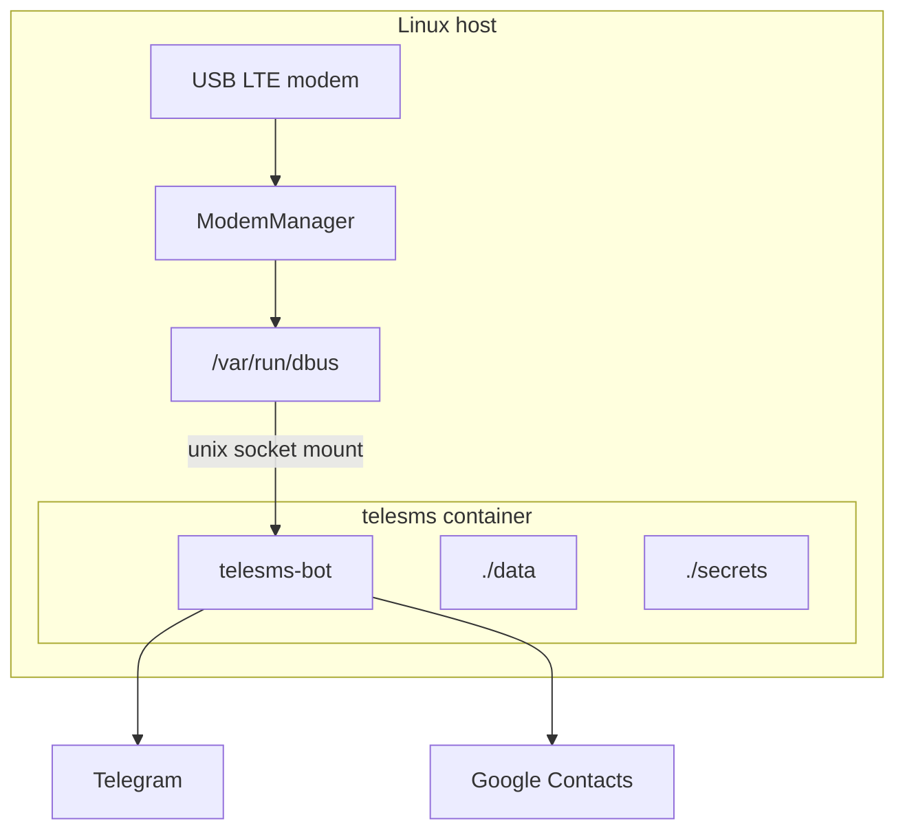
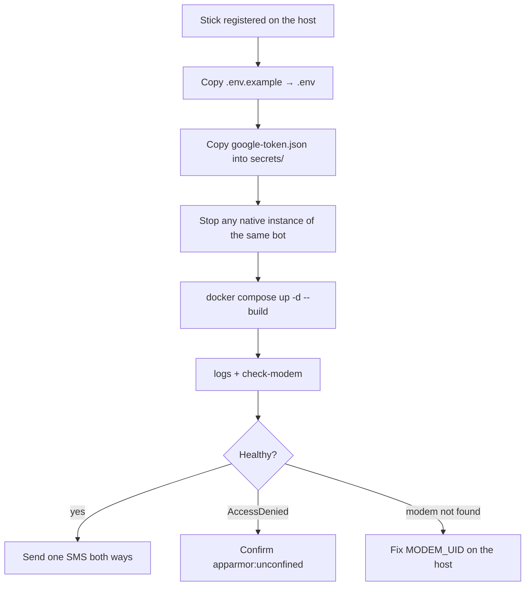

# Deploy with Docker Compose

Target: a Linux host where a USB LTE modem is already owned by
**host** ModemManager (bare metal, or a VM after
[Proxmox USB passthrough](proxmox-usb-passthrough.md) and
[Ubuntu modem setup](ubuntu-modem-setup.md)).

The container only talks to the system D-Bus socket. Do not pass
`/dev/cdc-wdm0` or `ttyUSB*` into it, and do not run ModemManager inside
Docker.



`compose.yaml` mounts `/var/run/dbus`, sets
`DBUS_SYSTEM_BUS_ADDRESS=unix:path=/var/run/dbus/system_bus_socket`,
runs as root-in-container (ModemManager’s D-Bus policy admits root), and
sets `apparmor:unconfined`.

Ubuntu’s `docker-default` AppArmor profile denies D-Bus `Hello` even
when the socket is mounted. Without that `security_opt` the bot panics:

```text
modemmanager dbus: Failed("org.freedesktop.DBus.Error.AccessDenied:
An AppArmor policy prevents this sender from sending this message…
member=\"Hello\" … destination=\"org.freedesktop.DBus\"")
```

Do not host untrusted containers on the same machine without revisiting
root-in-container + `apparmor:unconfined`.

---

## Deploy flow



---

## 1. Prerequisites (on the host)

- Stick visible and **registered**: [Ubuntu modem setup](ubuntu-modem-setup.md).
  `mmcli -m "$MODEM_UID"` must print `System.device` equal to `.env`
  `MODEM_UID` (for the DWM-222 preset: `dwm222`, not `/sys/devices/…`).
- Docker Engine + Compose plugin.

## 2. Get the code

```bash
git clone <repo-url> telesms-bot
cd telesms-bot
```

## 3. Configure

```bash
cp .env.example .env
$EDITOR .env   # token, user id, group id, Google client id/secret, MODEM_UID
mkdir -p data secrets
```

Google OAuth needs a browser, so mint the token on a machine with a
browser and copy it over (never run `auth` on a headless host):

```bash
scp secrets/google-token.json <user>@<host>:telesms-bot/secrets/
```

Set `TZ` in `compose.yaml` to the host timezone.

## 4. Stop any other daemon using the same bot

Two instances of the same bot token conflict on Telegram `getUpdates`
(HTTP 409). Stop any native `cargo run` / systemd instance before
starting the container.

## 5. Start

```bash
docker compose up -d --build
```

First build compiles every crate: expect 10–20 minutes. Later builds hit
the BuildKit cache and take ~1–2 minutes.

## 6. Verify

```bash
docker compose logs -f
docker compose run --rm telesms telesms-bot check-modem
```

| You see | Meaning |
|---|---|
| `google contacts synced` | Token + network OK |
| `check-modem` prints `/org/freedesktop/ModemManager1/Modem/N` | D-Bus + `MODEM_UID` match |
| `processing modem inbox n=…` | Inbox subscribe OK |
| `AccessDenied` / D-Bus `Hello` panic | AppArmor — confirm `compose.yaml` has `apparmor:unconfined`, then `docker compose up -d` |
| `modem not found: dwm222` | Host `System.device` is not `dwm222` yet — [Ubuntu modem setup](ubuntu-modem-setup.md) |
| `check-modem` OK but inbox still failing | Restart the bot after ModemManager was restarted: `docker compose restart telesms` |

Then send one SMS to the stick → Telegram topic, and type in a contact
topic → the phone.

## 7. Update

```bash
git pull
docker compose up -d --build
```

---

## Notes

- Config change: edit `.env`, then `docker compose up -d` (recreates the
  container with the new env).
- Logs rotate at 10 MB × 3 files (`json-file` driver).
- After a big dependency change, a stale cache mount can break the build;
  fix with `docker builder prune` and rebuild.
- Host reboot: systemd starts Docker after dbus; the container
  auto-starts. If `mmcli` shows `state: disabled`, enable the modem
  ([Ubuntu modem setup](ubuntu-modem-setup.md)) and
  `docker compose restart telesms`.
- After you restart ModemManager on the host (UID fix, USB replug),
  restart the container so it does not sit on a stale D-Bus subscribe
  from the probe window.
