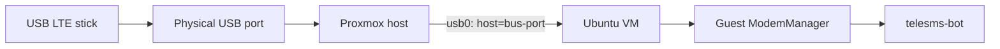
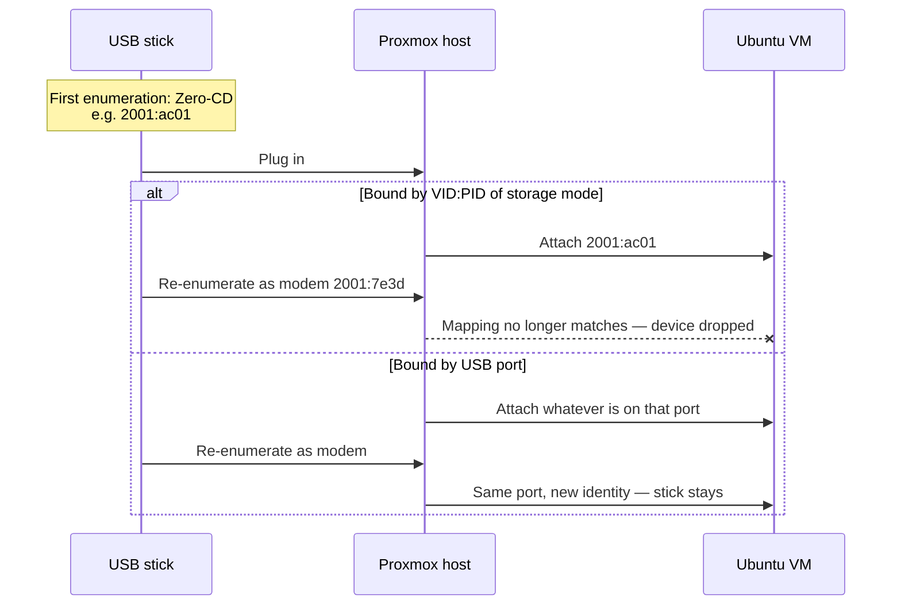
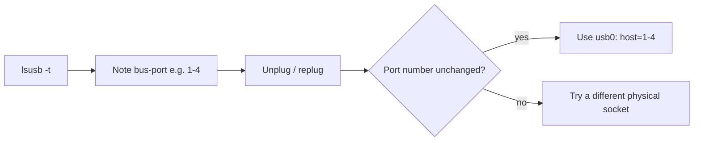
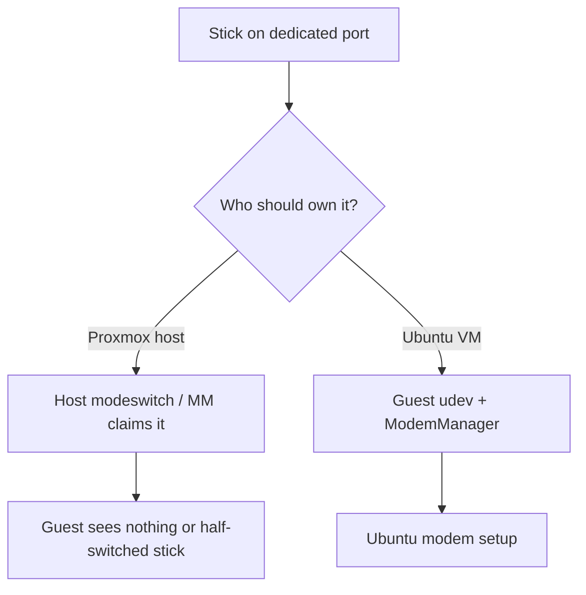

# Proxmox: pass a USB LTE modem into the Ubuntu VM

Pass the stick from the Proxmox host into the guest by **USB port**, not
by vendor/product ID.

Many LTE sticks **re-enumerate** (virtual CD first, then modem). A
D-Link DWM-222 goes `2001:ac01` → `2001:7e3d`. If you bind the VM to a
vendor/product pair, Proxmox drops the device at that switch and the VM
never sees the modem.

Always pass through the **USB port**, not VID:PID.

The guest can have a QEMU XHCI controller and still show **only USB root
hubs**. That means this guide is not done yet — nothing is attached to
that controller.



After the guest sees the stick, continue with
[Ubuntu modem setup](ubuntu-modem-setup.md) **inside the VM**.

---

## Why port mapping, not VID:PID



---

## 1. Find the port on the Proxmox host

Plug the stick into the physical port you will dedicate to it. On the
Proxmox host (not the VM):

```bash
lsusb
lsusb -t
```

Note **bus** and **port** (for example bus 1 port 4 → `1-4`). Prefer a
port on the chassis you will not use for keyboards or disks.

Unplug and replug once. Confirm the **port number stays the same** even
if the product ID changes (zero-CD → modem).



---

## 2. Attach that port to the VM

### GUI

1. Select the Ubuntu VM → **Hardware** → **Add** → **USB Device**.
2. Choose **Use USB Port** (or “USB Port”, not “Use USB Vendor/Device ID”).
3. Pick the port from step 1.
4. Leave it attached across reboots.

### CLI / config

In `/etc/pve/qemu-server/<VMID>.conf` you want a **host port** mapping,
similar to:

```text
usb0: host=1-4
```

Not:

```text
usb0: vendor=2001,product=ac01
usb0: vendor=2001,product=7e3d
```

If the file already has a vendor/product line for this stick, remove it
and replace with the port form. Then:

```bash
qm set <VMID> --usb0 host=1-4
# or restart the VM after editing the conf
```

Use the bus-port you actually measured.

---

## 3. Where modeswitch runs

Run `usb_modeswitch` / udev eject **inside the Ubuntu VM**, not on the
Proxmox host.

If the Proxmox host claims the device (its own `usb_modeswitch` or
ModemManager), the VM may see nothing or a half-switched stick. On the
host, blacklist or avoid binding `option` / `qmi_wwan` / modeswitch for
this port if that becomes a problem.



---

## 4. Check from the VM

```bash
lsusb
lsusb -t
```

| Guest `lsusb` | Meaning |
|---|---|
| Only `Linux Foundation` root hubs | Passthrough missing (VID:PID bind, wrong port, or stick unplugged) |
| `2001:ac01` mass storage / CD | Zero-CD; modeswitch on the **guest** — [Ubuntu modem setup](ubuntu-modem-setup.md) |
| `2001:7e3d D-Link Corp. Mobile Connect` with `option` + `qmi_wwan` | Stick is in the guest. One leftover `usb-storage` interface in this mode is normal. Continue with modem setup. |

Then ModemManager + UID on the guest:
[Ubuntu modem setup](ubuntu-modem-setup.md). Then the bot:
[Docker Compose](deploy-docker.md).

---

## 5. Hotplug and reboot

- Port passthrough survives a storage → modem re-enumeration.
- Reboot the VM with the stick inserted; it should reappear on the same
  port.
- Moving the stick to another physical socket requires updating `host=…`.
