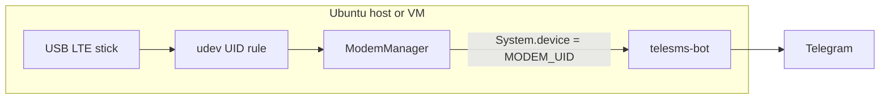
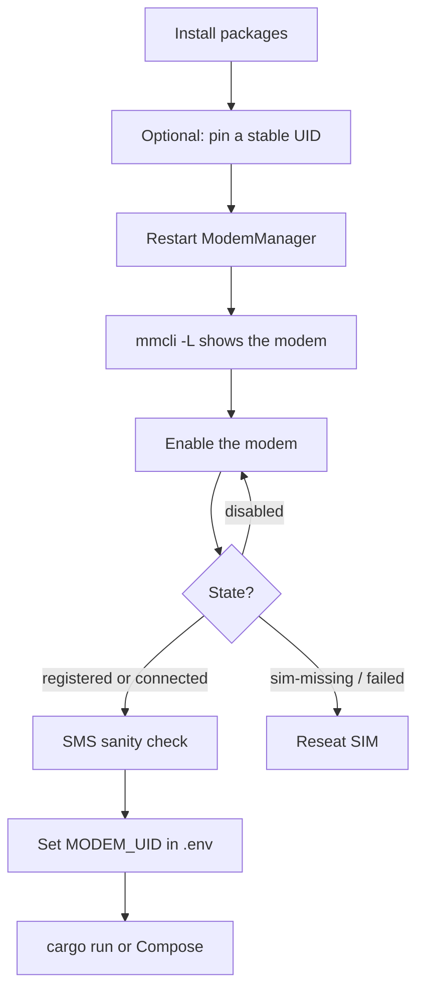
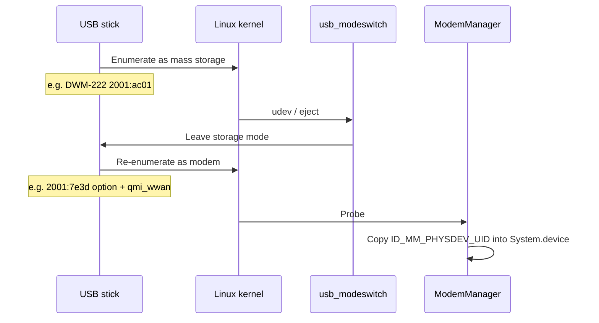
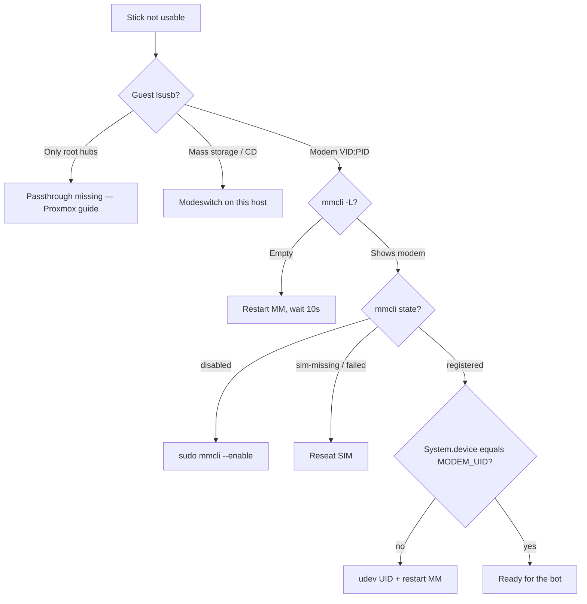

# Ubuntu: prepare a USB LTE modem

The bot talks to **host** ModemManager over D-Bus. It never opens
`/dev/cdc-wdm0`. Set `MODEM_UID` to the modem’s **Device** field
(`mmcli` `System.device`).

If the host is a VM, attach the stick first:
[Proxmox USB passthrough](proxmox-usb-passthrough.md). Then run this
guide **inside the guest**.

Tested with a D-Link DWM-222 (QMI). Other QMI/MBIM sticks that appear in
`mmcli -L` follow the same steps.



---

## Bring-up overview



---

## 1. Packages and udev

From a checkout of this repo:

```bash
sudo ./scripts/setup-ubuntu-modem.sh
```

That installs `usb-modeswitch` and `modemmanager`, enables ModemManager,
and adds your user to `dialout`.

### Stable name (recommended)

ModemManager indexes (`/Modem/0`) change on every replug. Pin a UID so
`MODEM_UID` stays valid:

```bash
# After the stick is in modem mode, copy VENDOR:PRODUCT from lsusb:
lsusb
sudo ./scripts/setup-ubuntu-modem.sh --uid stick --usb abcd:1234
```

Zero-CD sticks (virtual CD first, then modem) also need the storage-mode
id:

```bash
sudo ./scripts/setup-ubuntu-modem.sh --uid stick --usb abcd:1234 --storage abcd:5678
```

D-Link DWM-222 (sold as “DWM-22”):

```bash
sudo ./scripts/setup-ubuntu-modem.sh --preset dwm222
```

That sets UID `dwm222`, modem-mode `2001:7e3d`, storage `2001:ac01`.

The script writes:

| Path | Role |
|---|---|
| `/etc/udev/rules.d/40-telesms-modem.rules` | UID + device perms (`dialout`) |
| `/usr/share/usb_modeswitch/…` | StandardEject when `--storage` is set |
| `/usr/local/bin/telesms-modem` | `mmcli -m <uid>` wrapper |

Adding the udev rule is **not** enough by itself. ModemManager copies
`ID_MM_PHYSDEV_UID` into `System.device` at **probe** time. If the stick
was already enumerated, `udevadm info` can show `ID_MM_PHYSDEV_UID=dwm222`
while `mmcli` still prints a sysfs path. Restart MM, then wait ~10 s:

```bash
sudo systemctl restart ModemManager
sleep 10
lsusb
mmcli -L
mmcli -m dwm222          # or: telesms-modem
```

`System.device` must equal the UID you passed. Put that value in `.env`
as `MODEM_UID`.

A VM cannot unplug the physical stick; the MM restart is the usual fix
there.

---

## 2. Without a UID rule

```bash
mmcli -L
mmcli -m 0
```

Copy the **Device** line into `MODEM_UID`. It may be a sysfs path and can
change if you move the stick to another USB port. Prefer `--uid` + `--usb`.

---

## 3. Enable and register

Wait ~20 s after plug for probe. `mmcli` may show `state: disabled` even
with a healthy SIM. Listing works as a normal user; **enable** needs
root / polkit:

```bash
sudo mmcli -m "$MODEM_UID" --enable
sleep 8
mmcli -m "$MODEM_UID"
# expect: state registered (or connected)
```

`lock: sim-pin2` / `enabled locks: fixed-dialing` is **not** PIN1. Do not
treat that as a blocked SIM. If PIN1 really is locked:

```bash
sudo mmcli -i any --pin=1234
```

SMS works in `registered` without a data bearer. Sanity check before
starting the bot:

```bash
mmcli -m "$MODEM_UID" --messaging-list-sms
SMS=$(mmcli -m "$MODEM_UID" --messaging-create-sms="number=+98912xxxxxxx,text='hello'" | awk '{print $NF}')
mmcli -s "$SMS" --send
```

SIM missing or poorly seated shows up as ModemManager `failed` /
`sim-missing` and QMI `no-atr-received`. Reseat the tray.

Do **not** open `/dev/cdc-wdm0` with `qmicli` while ModemManager is running
unless you use `qmi-proxy`. Direct open returns `endpoint hangup`.

---

## 3b. Call forwarding (optional)

Telegram `/forward` and `GET`/`PUT /api/v1/call-forward` control
**unconditional** CFU via ModemManager.

1. **Preferred:** `AT+CCFC` through MM’s `Command` API — works across
   Iranian operators (MCI, Irancell, Shatel Mobile, Aptel, …) when the
   stick exposes AT.
2. **Fallback:** USSD `*#21#` / `*21*…#` / `#21#` — often fails on QMI
   sticks with `SupsFailureCase`.

ModemManager **blocks** arbitrary AT unless the daemon is started with
`--debug` (by design). Without that you get `Unauthorized: Operation only
allowed in debug mode` and call-forward will fail when USSD is also
broken.

Enable AT for a personal gateway (verbose MM logs; fine for a home host):

```bash
sudo mkdir -p /etc/systemd/system/ModemManager.service.d
sudo tee /etc/systemd/system/ModemManager.service.d/telesms-at-debug.conf >/dev/null <<'EOF'
[Service]
# Unlock mmcli/D-Bus Command (AT+CCFC) for telesms-bot call forwarding.
ExecStart=
ExecStart=/usr/sbin/ModemManager --debug
EOF
# Some distros install the binary under /usr/bin — check first:
#   systemctl cat ModemManager | grep ExecStart
sudo systemctl daemon-reload
sudo systemctl restart ModemManager
sleep 10
mmcli -m "$MODEM_UID" --command='AT+CCFC=0,2'
```

Expect `+CCFC: …` and/or `OK`. Then restart telesms-bot and retry
`/forward` or `GET /api/v1/call-forward`.

To undo later: remove the drop-in, `daemon-reload`, restart ModemManager.

---

## 4. Point the bot at it

```bash
# .env
MODEM_UID=dwm222          # must equal mmcli System.device exactly
```

Then `cargo run` or Compose ([Docker Compose](deploy-docker.md)).

---

## Zero-CD (modeswitch)

Many LTE sticks first appear as a virtual CD, then switch to modem mode.
That switch must happen on the **same machine** that runs ModemManager.



---

## Troubleshooting



| Symptom | What to do |
|---|---|
| `lsusb` only root hubs | Stick is not on this machine — [Proxmox USB passthrough](proxmox-usb-passthrough.md) |
| Stuck as USB CD / mass storage (`2001:ac01` on a DWM-222) | `--storage` + that VID:PID; `eject /dev/sr0`; check udev |
| Modem-mode `2001:7e3d` still shows one `usb-storage` interface | Normal leftover SD/CD iface; ignore if `option` + `qmi_wwan` are bound |
| `mmcli`: `sim-missing` | Reseat mini-SIM |
| `Couldn't get SIM lock status after 7 retries` | Same as missing SIM, or probe raced — unplug, wait 5 s, replug |
| `mmcli -L` empty after `systemctl restart ModemManager` | Wait ~10 s for re-probe |
| `mmcli -m 0` works, `mmcli -m dwm222` does not | udev UID not applied at probe — restart ModemManager (section 1) |
| `mmcli -m <uid>` not found, udev has no `ID_MM_PHYSDEV_UID` | Re-run the setup script; `udevadm info` on the USB device |
| `state: disabled` | `sudo mmcli -m "$MODEM_UID" --enable` |
| `qmicli`: endpoint hangup | Stop ModemManager or use `--device-open-proxy` |
| Bot: `modem not found: dwm222` | `MODEM_UID` ≠ `System.device` (still a sysfs path, or typo) |

---

## D-Link DWM-222 notes

This firmware stays in **QMI** on Linux. SMS goes through ModemManager, not
the stick’s RNDIS web UI (`192.168.0.1`).

| Mode | USB id |
|---|---|
| Zero-CD (first plug) | `2001:ac01` |
| Modem mode | `2001:7e3d` — `option` + `qmi_wwan` |
| Preset | `--preset dwm222` → UID `dwm222` |

`lsusb` after a good plug: `2001:7e3d D-Link Corp. Mobile Connect`.
